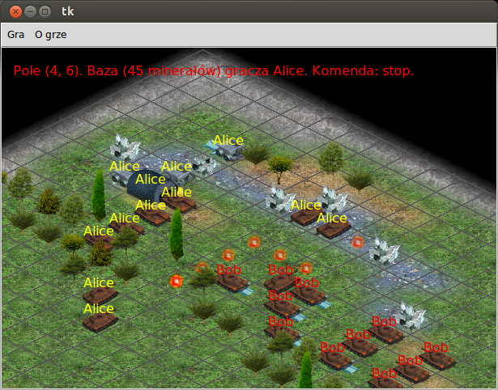

=======================
Co to jest Scriptcraft?
=======================

Scriptcraft jest grą polegającą na zaprogramowaniu własnych jednostek
(bazy, zbieraczy minerałów i czołgów) tak, aby pokonać innych
graczy. Internetowy wieloosobowy (MMORTS!) pierwowzór dostępny jest
pod adresem http://informatyka.wroc.pl/scriptcraft, natomiast **ten
projekt jest** jego **klonem, dzięki któremu możesz uruchomić
Scriptcraft'a na własnym komputerze**. W ten sposób możesz szybko
przetestować programy Twoich jednostek, zanim zmierzą się one z
prawdziwymi graczami w internetowej wersji Scriptcraft'a.

==========
Możliwości
==========

W chwili obecnej Scriptcraft jest we wczesnym stadium rozwoju, dlatego
udostępnia on najbardziej podstawowe funkcje i możliwości.

- Dostępna jest jedna mapa o rozmiarze 64x64.
- Gry można zapisywać i wczytywać.
- Programy można pisać w następujących językach: ``python``, ``c++``;
  ponadto istnieje tzw. ``star-program``, który wykonuje polecenia
  wysyłane przez inną jednostkę.
- Można wysyłać zapytania systemowe (zobacz `dokumentację gry`_) oraz
  wiadomości między jednostkami.
- Wszystkie polecenia wydawane jednostkom przez Twoje programy są
  interpretowane tak samo jak w wersji internetowej **z wyjątkiem**
  polecenia ``PROGRAM``, które w chwili obecnej nie jest
  zaimplementowane. W zamian za to nowo produkowane jednostki
  otrzymują taki sam program jaki ma baza.

.. _`dokumentację gry`: http://informatyka.wroc.pl/node/714

Scriptcraft działa pod Pythonem 2.6 i 2.7 pod Linuxem. Planowana jest
obsługa także systemu Windows.

==========
Screenshot
==========

==========
Instalacja
==========

Scriptcraft można zainstalować na dwa sposoby. Prostszy sposób polega
na wpisaniu w bashu:

  pip install scriptcraft

Drugim sposobem jest pobranie źródeł z `pypi`_ lub z `githuba`_. Po
ściągnięciu i rozpakowaniu paczki należy wpisać w bashu:

  python setup.py install

.. _`pypi`: http://pypi.python.org/pypi/scriptcraft/
.. _`githuba`: https://github.com/krzysiumed/scriptcraft

============
Uruchomienie
============
W bashu wpisujemy:

  scriptcraft

Aby móc programować jednostki w języku C++, potrzebny jest kompilator
``g++``.
